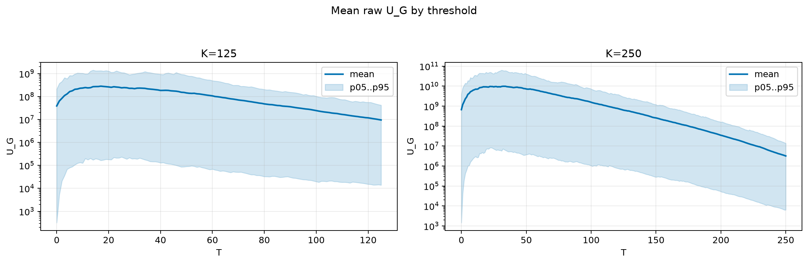
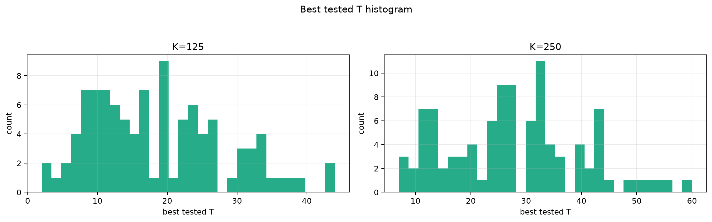
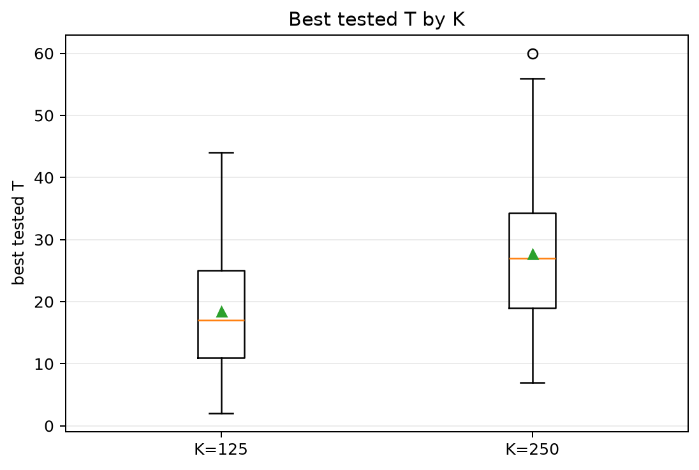
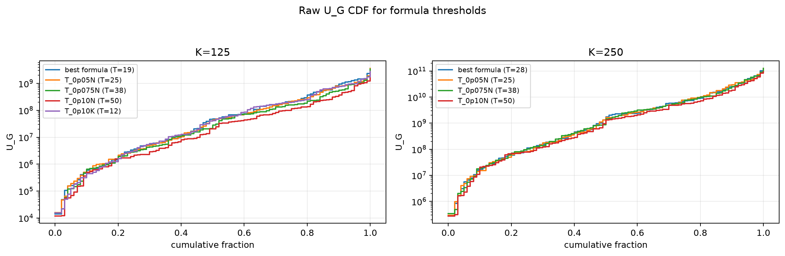
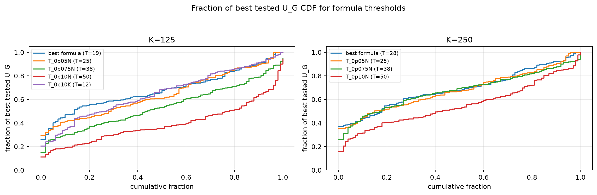

# Threshold Full Sweep: lognormal

> Historical K semantics note: this report uses active-K semantics. Here `K` is the number of selected/kept antennas, not the number turned off. A `25% active` or `K=0.25N` case means `75% off`, not the real `25% off` task. For real off-percent experiments, `25% off => K_active=0.75N` and `50% off => K_active=0.50N`.

- N: 500
- L: 6
- K values: 125, 250
- Samples: 100
- Generator seeds: 42
- Sigma: 1.0

The experiment sweeps every integer `T` from `0` to `K` and evaluates raw `U_G`.

## Answer

- `K=125`: best fixed `T=17`; 99% mean-`U_G` diapason `17..17`; best tested `T` median `17.0` (p05..p95 `7.0..35.0`).
- `K=250`: best fixed `T=32`; 99% mean-`U_G` diapason `32..34`; best tested `T` median `27.0` (p05..p95 `10.9..49.0`).

## Best Fixed Thresholds And Formula Checks

| K | best fixed T | 99% diapason | best tested T median | best tested T std | best formula | formula T | formula fraction |
|---:|---:|---|---:|---:|---|---:|---:|
| 125 | 17 | 17..17 | 17.000 | 9.516 | T_0p05NL_over_Lp2 | 19 | 0.6831 |
| 250 | 32 | 32..34 | 27.000 | 12.017 | T_0p075NL_over_Lp2 | 28 | 0.6933 |

## Plots

## Artifacts

- `threshold_runs.csv.gz`
- `best_thresholds.csv`
- `threshold_summary.csv`
- `threshold_best_t_stats.csv`
- `threshold_formula_comparison.csv`
