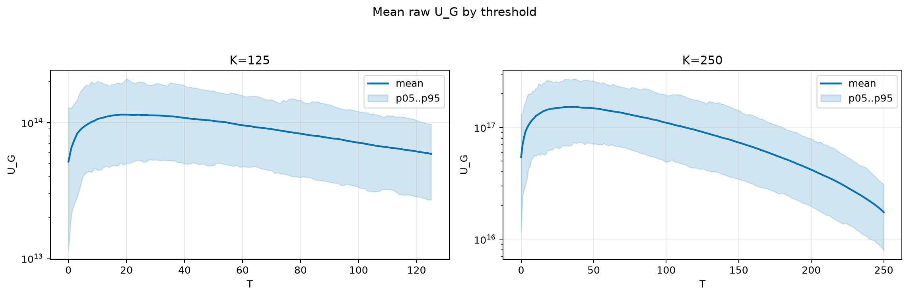
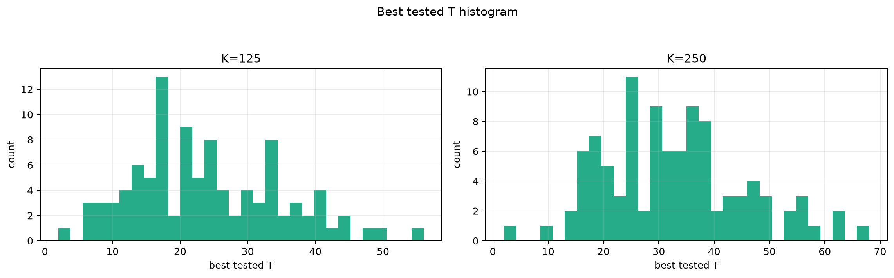
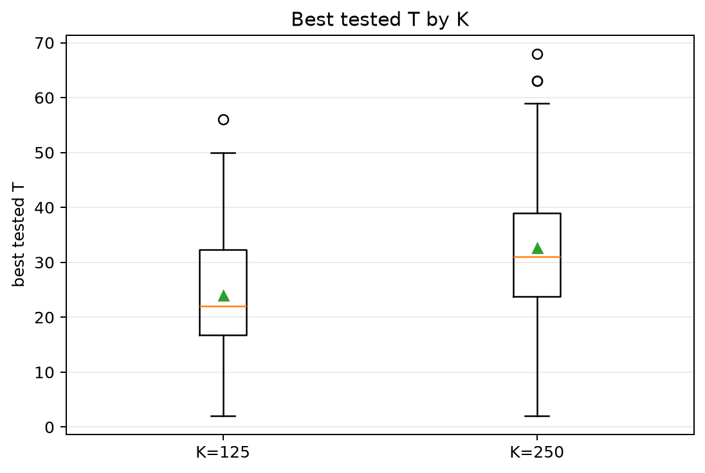
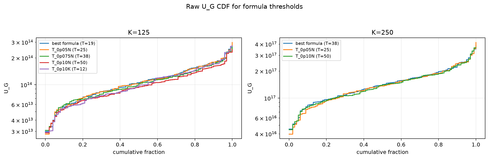
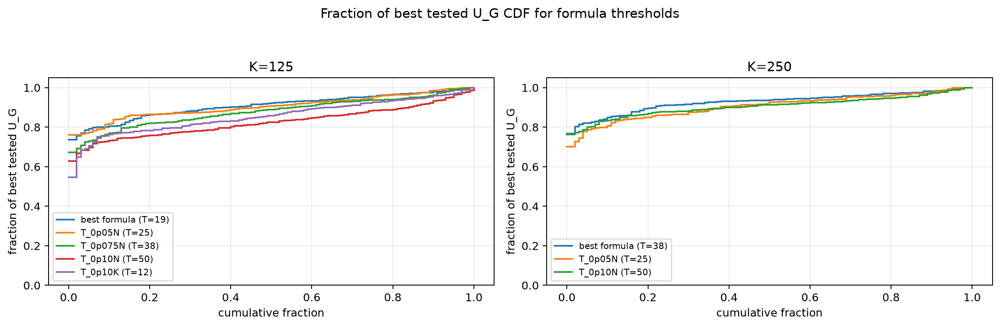

# Threshold Full Sweep: nakagami

- N: 500
- L: 6
- K values: 125, 250
- Samples: 100
- Generator seeds: 42
- Sigma: 1.0

The experiment sweeps every integer `T` from `0` to `K` and evaluates raw `U_G`.

## Answer

- `K=125`: best fixed `T=18`; 99% mean-`U_G` diapason `16..27`; best tested `T` median `22.0` (p05..p95 `8.0..43.0`).
- `K=250`: best fixed `T=37`; 99% mean-`U_G` diapason `29..39`; best tested `T` median `31.0` (p05..p95 `16.0..55.1`).

## Best Fixed Thresholds And Formula Checks

| K | best fixed T | 99% diapason | best tested T median | best tested T std | best formula | formula T | formula fraction |
|---:|---:|---|---:|---:|---|---:|---:|
| 125 | 18 | 16..27 | 22.000 | 10.970 | T_0p05NL_over_Lp2 | 19 | 0.9089 |
| 250 | 37 | 29..39 | 31.000 | 12.780 | T_0p075N | 38 | 0.9291 |

## Plots

## Artifacts

- `threshold_runs.csv.gz`
- `best_thresholds.csv`
- `threshold_summary.csv`
- `threshold_best_t_stats.csv`
- `threshold_formula_comparison.csv`
