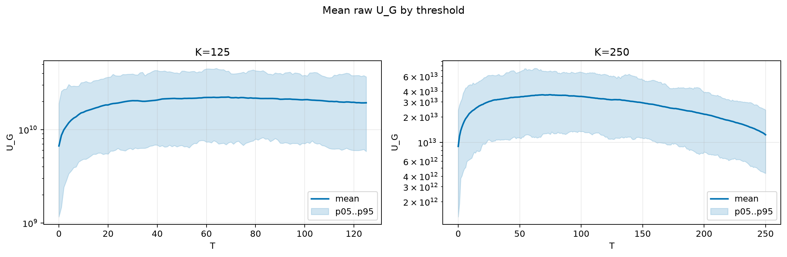
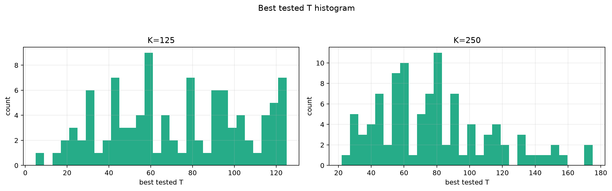
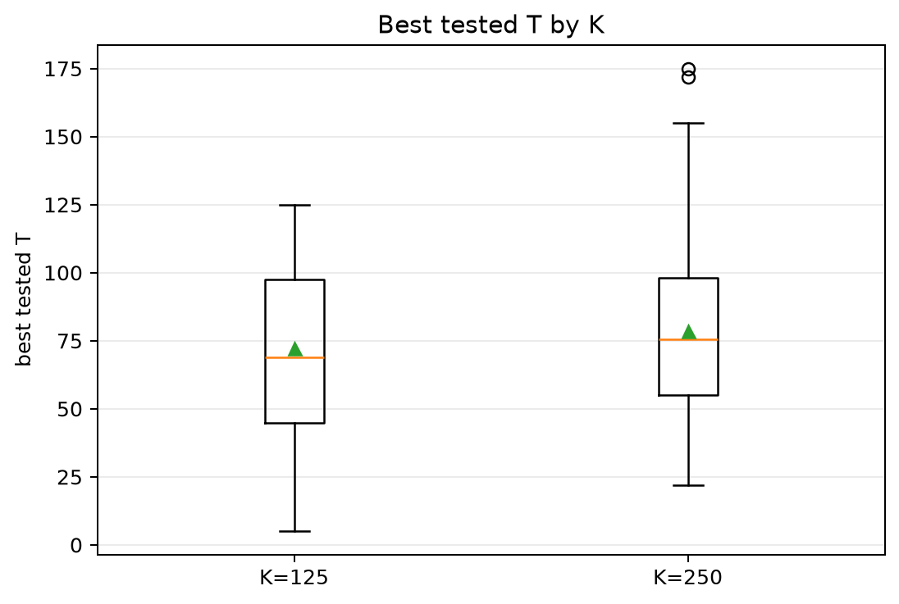
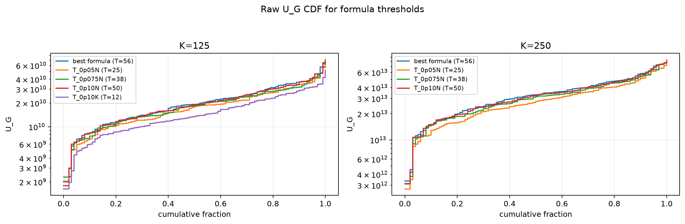
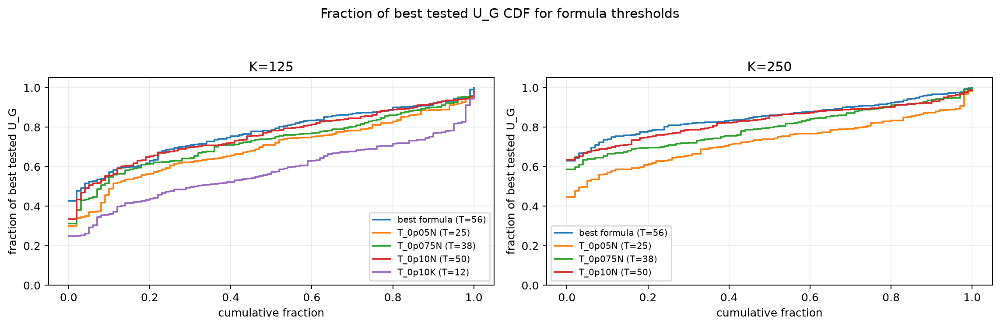

# Threshold Full Sweep: rician

- N: 500
- L: 6
- K values: 125, 250
- Samples: 100
- Generator seeds: 42
- Sigma: 1.0

The experiment sweeps every integer `T` from `0` to `K` and evaluates raw `U_G`.

## Answer

- `K=125`: best fixed `T=69`; 99% mean-`U_G` diapason `66..69`; best tested `T` median `69.0` (p05..p95 `21.9..123.0`).
- `K=250`: best fixed `T=75`; 99% mean-`U_G` diapason `65..78`; best tested `T` median `75.5` (p05..p95 `31.9..148.1`).

## Best Fixed Thresholds And Formula Checks

| K | best fixed T | 99% diapason | best tested T median | best tested T std | best formula | formula T | formula fraction |
|---:|---:|---|---:|---:|---|---:|---:|
| 125 | 69 | 66..69 | 69.000 | 32.469 | T_0p15NL_over_Lp2 | 56 | 0.7722 |
| 250 | 75 | 65..78 | 75.500 | 34.495 | T_0p15NL_over_Lp2 | 56 | 0.8531 |

## Plots

## Artifacts

- `threshold_runs.csv.gz`
- `best_thresholds.csv`
- `threshold_summary.csv`
- `threshold_best_t_stats.csv`
- `threshold_formula_comparison.csv`
