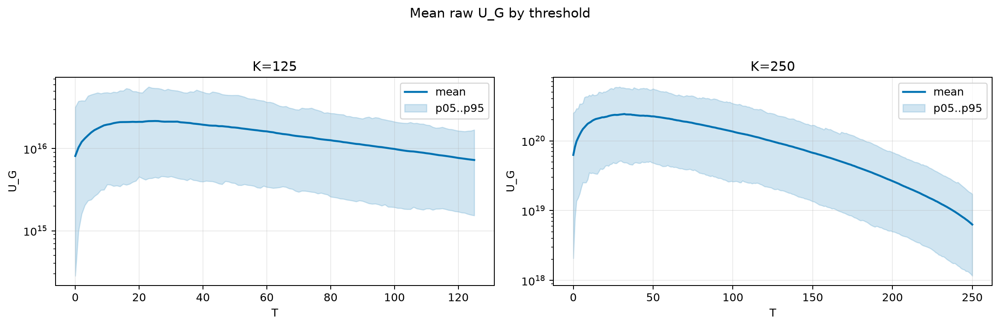
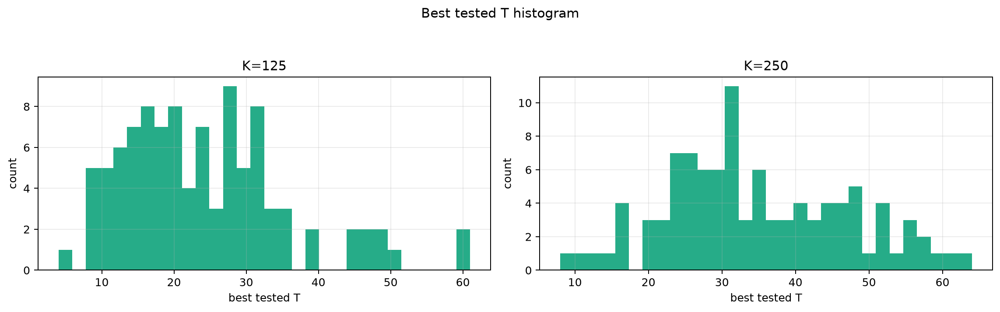
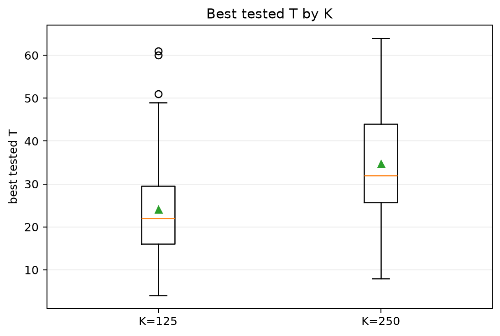
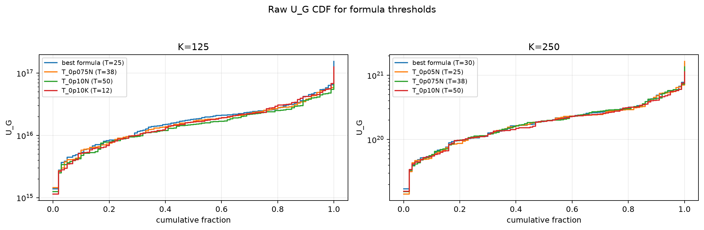
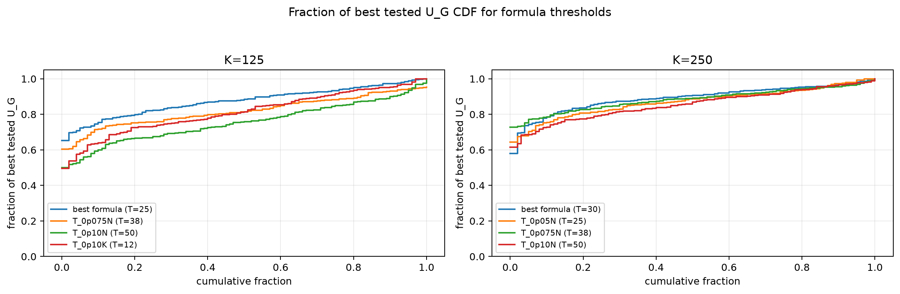

# Threshold Full Sweep: gaussian

- N: 500
- L: 8
- K values: 125, 250
- Samples: 100
- Generator seeds: 42
- Sigma: 1.0

The experiment sweeps every integer `T` from `0` to `K` and evaluates raw `U_G`.

## Answer

- `K=125`: best fixed `T=25`; 99% mean-`U_G` diapason `23..26`; best tested `T` median `22.0` (p05..p95 `8.9..47.0`).
- `K=250`: best fixed `T=32`; 99% mean-`U_G` diapason `31..32`; best tested `T` median `32.0` (p05..p95 `16.9..56.1`).

## Best Fixed Thresholds And Formula Checks

| K | best fixed T | 99% diapason | best tested T median | best tested T std | best formula | formula T | formula fraction |
|---:|---:|---|---:|---:|---|---:|---:|
| 125 | 25 | 23..26 | 22.000 | 11.465 | T_0p05N | 25 | 0.8761 |
| 250 | 32 | 31..32 | 32.000 | 12.390 | T_0p075NL_over_Lp2 | 30 | 0.8929 |

## Plots

## Artifacts

- `threshold_runs.csv.gz`
- `best_thresholds.csv`
- `threshold_summary.csv`
- `threshold_best_t_stats.csv`
- `threshold_formula_comparison.csv`
