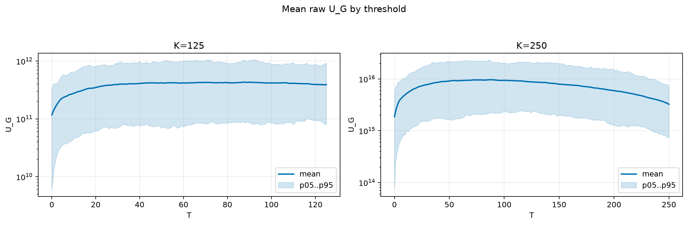
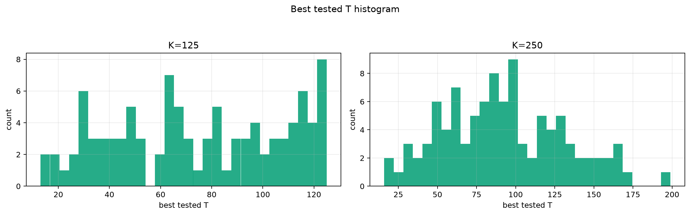
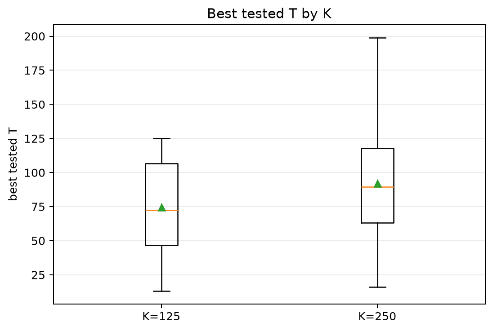
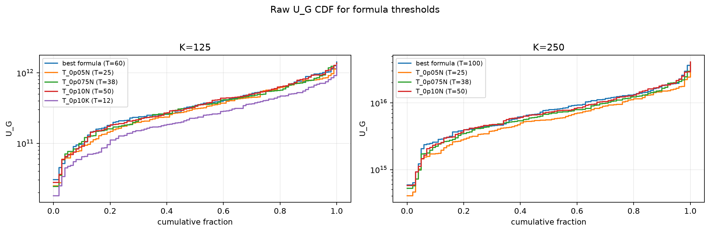
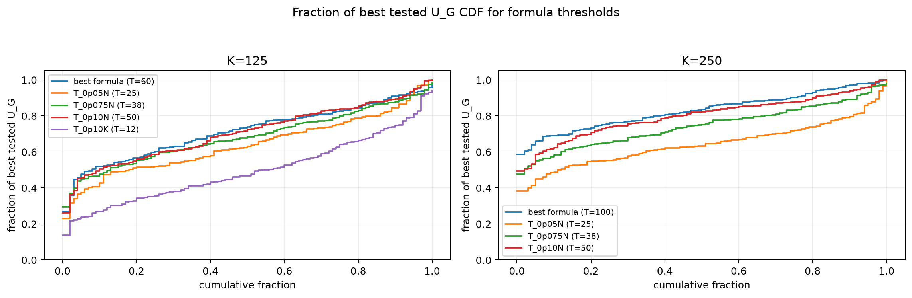

# Threshold Full Sweep: rician

- N: 500
- L: 8
- K values: 125, 250
- Samples: 100
- Generator seeds: 42
- Sigma: 1.0

The experiment sweeps every integer `T` from `0` to `K` and evaluates raw `U_G`.

## Answer

- `K=125`: best fixed `T=87`; 99% mean-`U_G` diapason `87..92`; best tested `T` median `72.5` (p05..p95 `24.9..124.0`).
- `K=250`: best fixed `T=87`; 99% mean-`U_G` diapason `85..90`; best tested `T` median `89.5` (p05..p95 `33.0..160.1`).

## Best Fixed Thresholds And Formula Checks

| K | best fixed T | 99% diapason | best tested T median | best tested T std | best formula | formula T | formula fraction |
|---:|---:|---|---:|---:|---|---:|---:|
| 125 | 87 | 87..92 | 72.500 | 33.355 | T_0p15NL_over_Lp2 | 60 | 0.7196 |
| 250 | 87 | 85..90 | 89.500 | 38.798 | legacy_T100 | 100 | 0.8326 |

## Plots

## Artifacts

- `threshold_runs.csv.gz`
- `best_thresholds.csv`
- `threshold_summary.csv`
- `threshold_best_t_stats.csv`
- `threshold_formula_comparison.csv`
