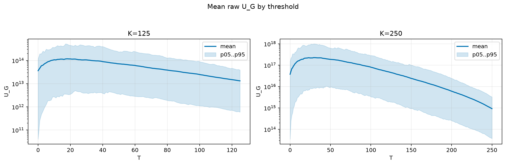
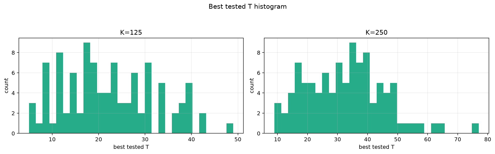
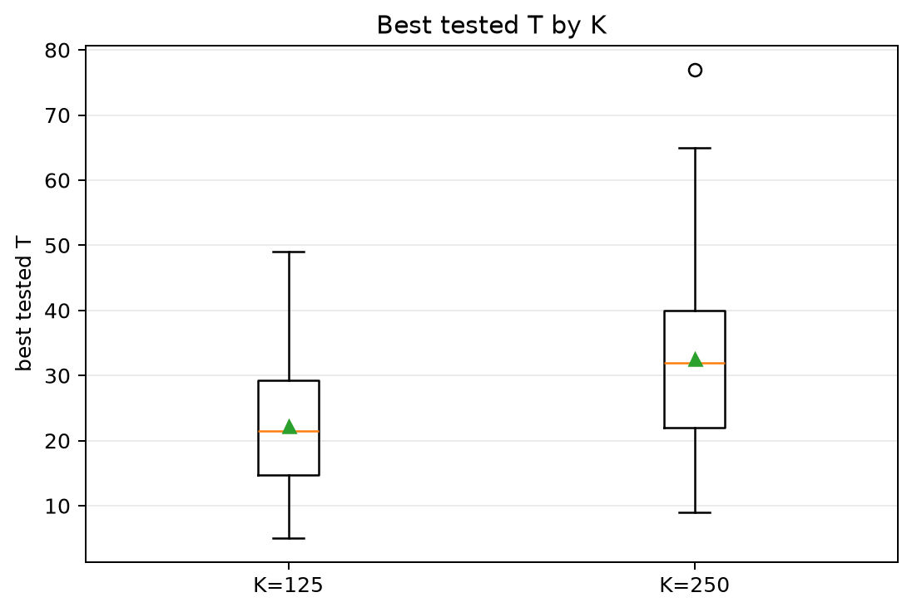
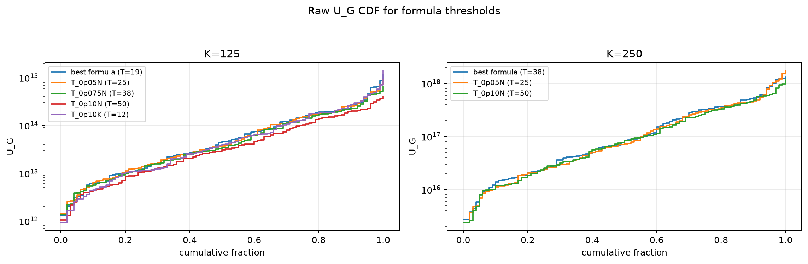
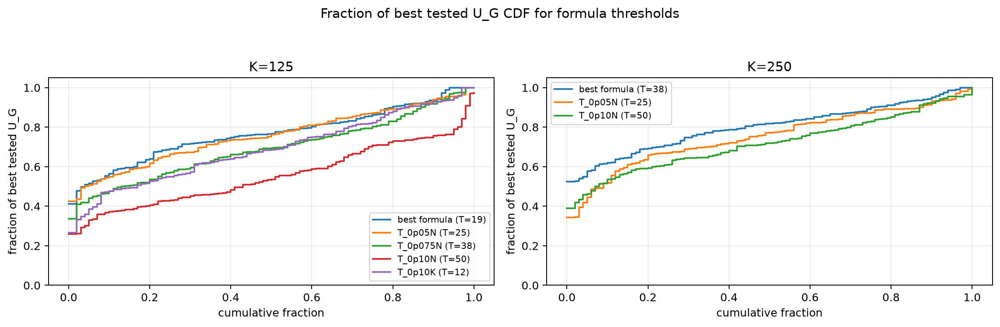

# Threshold Full Sweep: thin_tail

> Historical K semantics note: this report uses active-K semantics. Here `K` is the number of selected/kept antennas, not the number turned off. A `25% active` or `K=0.25N` case means `75% off`, not the real `25% off` task. For real off-percent experiments, `25% off => K_active=0.75N` and `50% off => K_active=0.50N`.

- N: 500
- L: 8
- K values: 125, 250
- Samples: 100
- Generator seeds: 42
- Sigma: 1.0

The experiment sweeps every integer `T` from `0` to `K` and evaluates raw `U_G`.

## Answer

- `K=125`: best fixed `T=18`; 99% mean-`U_G` diapason `18..18`; best tested `T` median `21.5` (p05..p95 `8.0..39.0`).
- `K=250`: best fixed `T=30`; 99% mean-`U_G` diapason `29..32`; best tested `T` median `32.0` (p05..p95 `13.9..53.1`).

## Best Fixed Thresholds And Formula Checks

| K | best fixed T | 99% diapason | best tested T median | best tested T std | best formula | formula T | formula fraction |
|---:|---:|---|---:|---:|---|---:|---:|
| 125 | 18 | 18..18 | 21.500 | 10.013 | T_0p15K | 19 | 0.7697 |
| 250 | 30 | 29..32 | 32.000 | 12.989 | T_0p075N | 38 | 0.8043 |

## Plots

## Artifacts

- `threshold_runs.csv.gz`
- `best_thresholds.csv`
- `threshold_summary.csv`
- `threshold_best_t_stats.csv`
- `threshold_formula_comparison.csv`
