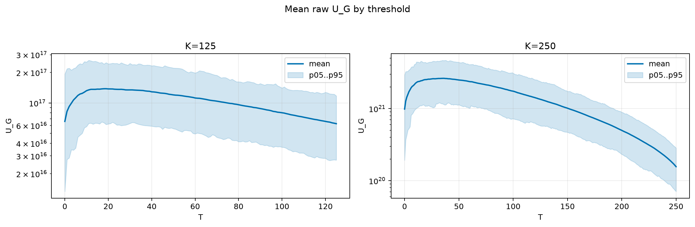
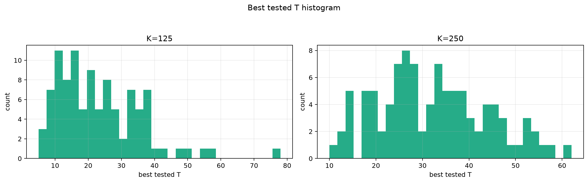
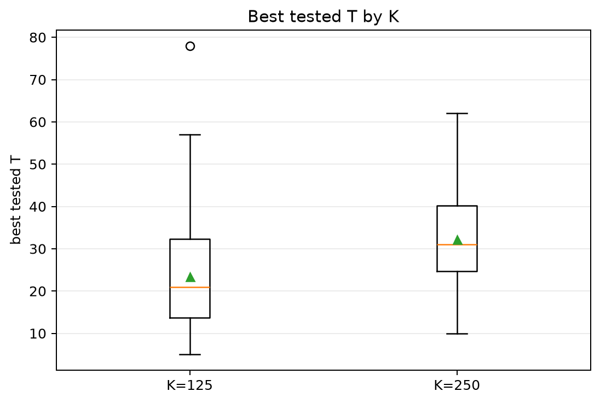
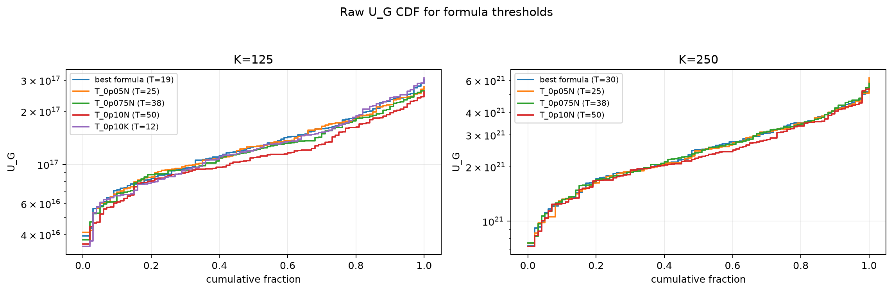
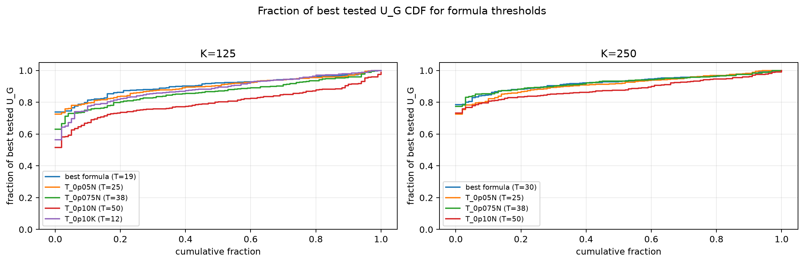

# Threshold Full Sweep: twdp

- N: 500
- L: 8
- K values: 125, 250
- Samples: 100
- Generator seeds: 42
- Sigma: 1.0

The experiment sweeps every integer `T` from `0` to `K` and evaluates raw `U_G`.

## Answer

- `K=125`: best fixed `T=19`; 99% mean-`U_G` diapason `15..22`; best tested `T` median `21.0` (p05..p95 `8.9..43.2`).
- `K=250`: best fixed `T=36`; 99% mean-`U_G` diapason `30..39`; best tested `T` median `31.0` (p05..p95 `15.0..53.0`).

## Best Fixed Thresholds And Formula Checks

| K | best fixed T | 99% diapason | best tested T median | best tested T std | best formula | formula T | formula fraction |
|---:|---:|---|---:|---:|---|---:|---:|
| 125 | 19 | 15..22 | 21.000 | 12.743 | T_0p15K | 19 | 0.9066 |
| 250 | 36 | 30..39 | 31.000 | 11.662 | T_0p075NL_over_Lp2 | 30 | 0.9255 |

## Plots

## Artifacts

- `threshold_runs.csv.gz`
- `best_thresholds.csv`
- `threshold_summary.csv`
- `threshold_best_t_stats.csv`
- `threshold_formula_comparison.csv`
