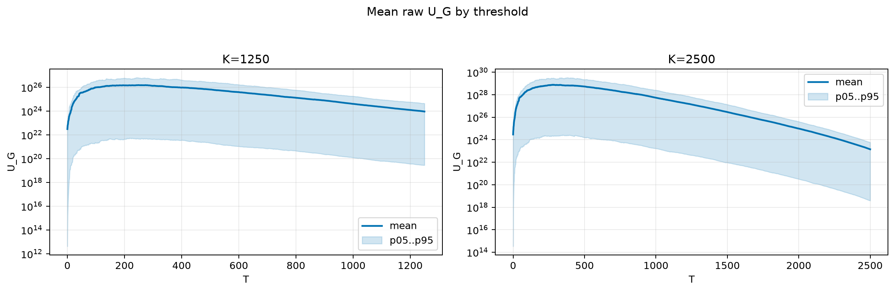
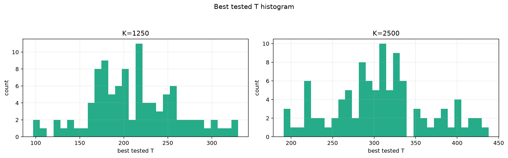
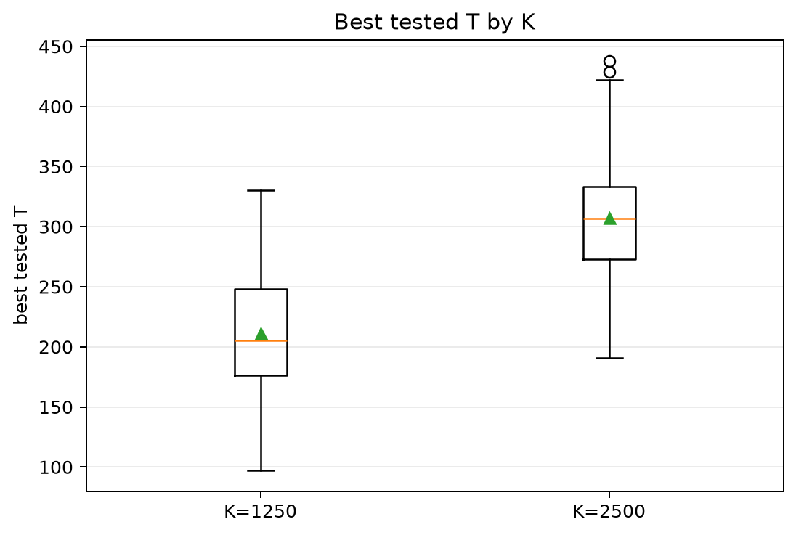
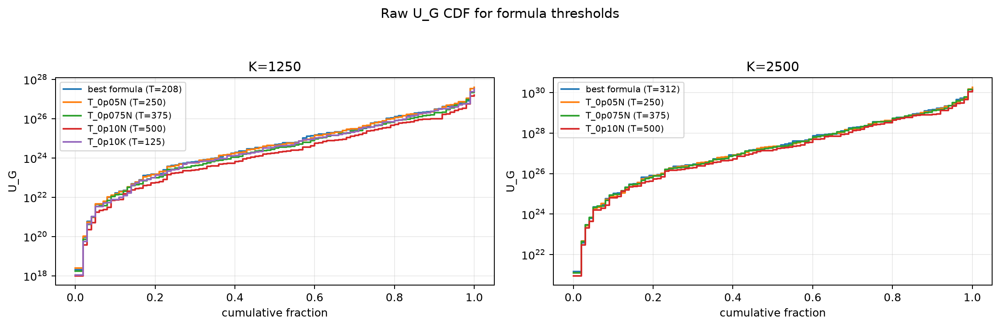
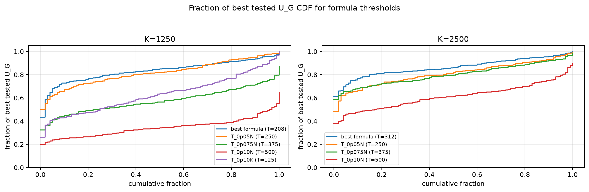

# Threshold Full Sweep: lognormal

> Historical K semantics note: this report uses active-K semantics. Here `K` is the number of selected/kept antennas, not the number turned off. A `25% active` or `K=0.25N` case means `75% off`, not the real `25% off` task. For real off-percent experiments, `25% off => K_active=0.75N` and `50% off => K_active=0.50N`.

- N: 5000
- L: 10
- K values: 1250, 2500
- Samples: 100
- Generator seeds: 42
- Sigma: 1.0

The experiment sweeps every integer `T` from `0` to `K` and evaluates raw `U_G`.

## Answer

- `K=1250`: best fixed `T=248`; 99% mean-`U_G` diapason `248..250`; best tested `T` median `205.5` (p05..p95 `131.5..306.0`).
- `K=2500`: best fixed `T=279`; 99% mean-`U_G` diapason `279..280`; best tested `T` median `307.0` (p05..p95 `215.9..411.2`).

## Best Fixed Thresholds And Formula Checks

| K | best fixed T | 99% diapason | best tested T median | best tested T std | best formula | formula T | formula fraction |
|---:|---:|---|---:|---:|---|---:|---:|
| 1250 | 248 | 248..250 | 205.500 | 50.094 | T_0p05NL_over_Lp2 | 208 | 0.8358 |
| 2500 | 279 | 279..280 | 307.000 | 57.823 | T_0p075NL_over_Lp2 | 312 | 0.8654 |

## Plots

## Artifacts

- `threshold_runs.csv.gz`
- `best_thresholds.csv`
- `threshold_summary.csv`
- `threshold_best_t_stats.csv`
- `threshold_formula_comparison.csv`
