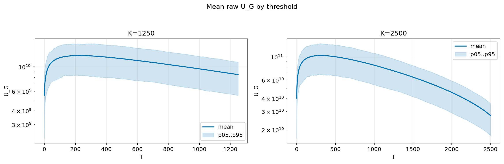
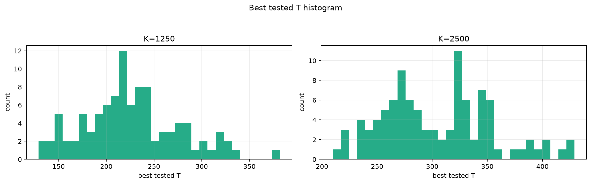
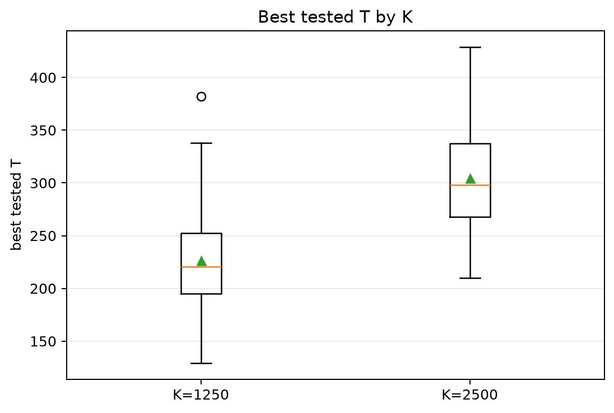
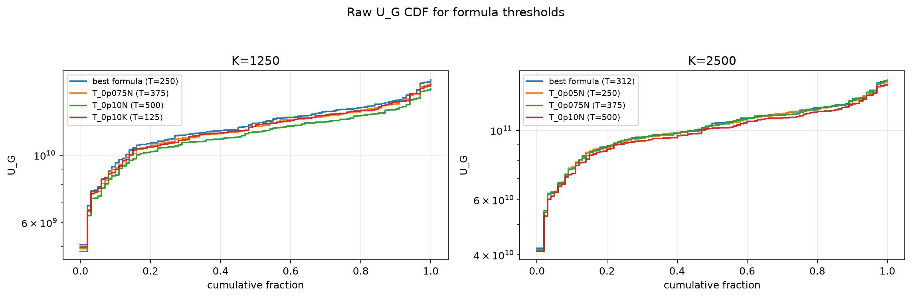
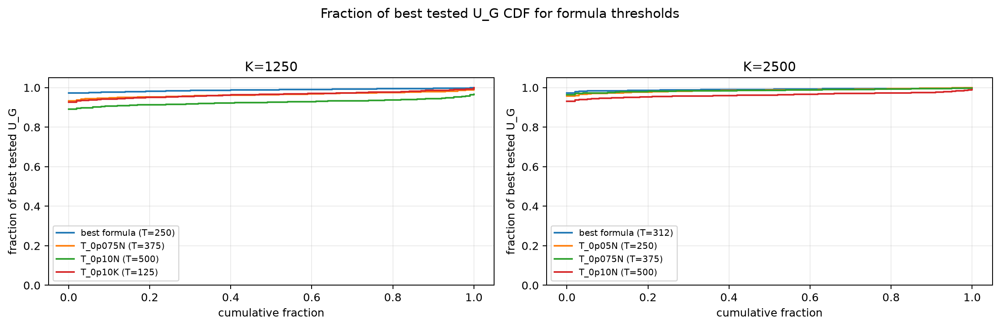

# Threshold Full Sweep: nakagami

- N: 5000
- L: 2
- K values: 1250, 2500
- Samples: 100
- Generator seeds: 42
- Sigma: 1.0

The experiment sweeps every integer `T` from `0` to `K` and evaluates raw `U_G`.

## Answer

- `K=1250`: best fixed `T=217`; 99% mean-`U_G` diapason `160..313`; best tested `T` median `220.5` (p05..p95 `149.0..317.2`).
- `K=2500`: best fixed `T=322`; 99% mean-`U_G` diapason `228..409`; best tested `T` median `298.0` (p05..p95 `234.9..397.2`).

## Best Fixed Thresholds And Formula Checks

| K | best fixed T | 99% diapason | best tested T median | best tested T std | best formula | formula T | formula fraction |
|---:|---:|---|---:|---:|---|---:|---:|
| 1250 | 217 | 160..313 | 220.500 | 50.370 | T_0p05N | 250 | 0.9882 |
| 2500 | 322 | 228..409 | 298.000 | 49.558 | T_0p125NL_over_Lp2 | 312 | 0.9913 |

## Plots

## Artifacts

- `threshold_runs.csv.gz`
- `best_thresholds.csv`
- `threshold_summary.csv`
- `threshold_best_t_stats.csv`
- `threshold_formula_comparison.csv`
