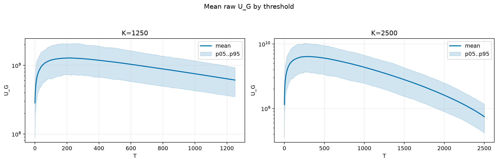
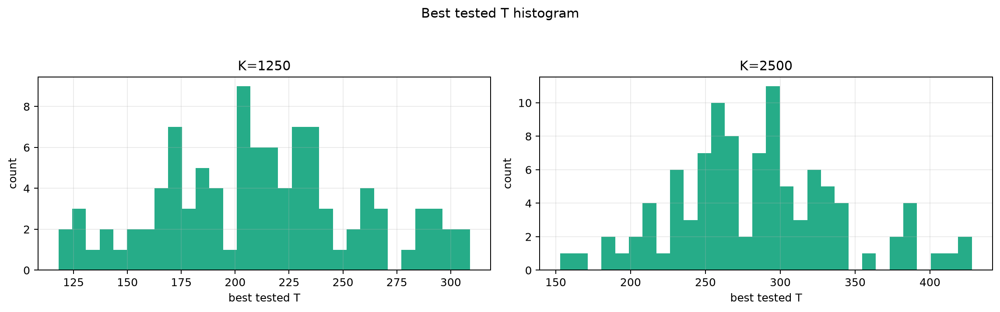
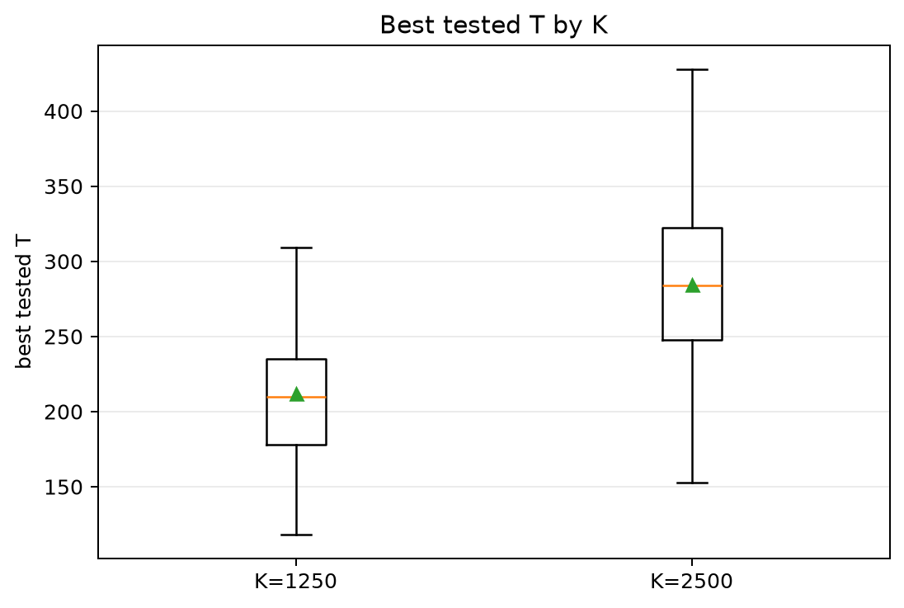
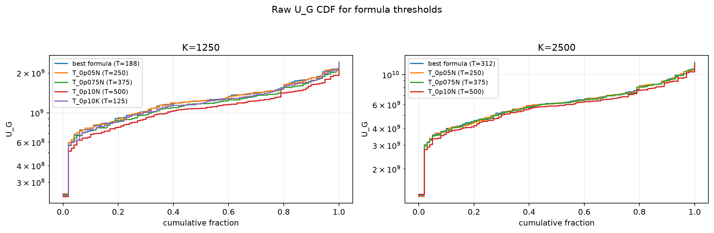
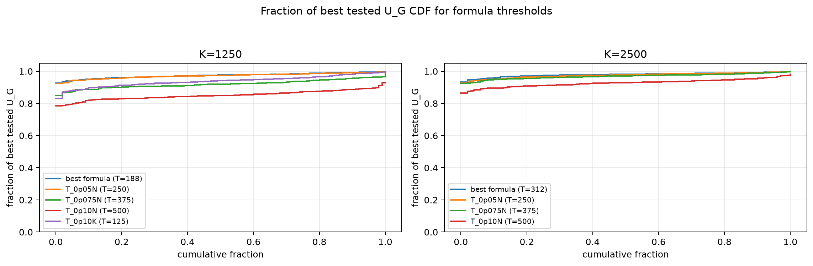

# Threshold Full Sweep: thin_tail

- N: 5000
- L: 2
- K values: 1250, 2500
- Samples: 100
- Generator seeds: 42
- Sigma: 1.0

The experiment sweeps every integer `T` from `0` to `K` and evaluates raw `U_G`.

## Answer

- `K=1250`: best fixed `T=211`; 99% mean-`U_G` diapason `174..254`; best tested `T` median `210.0` (p05..p95 `136.7..294.1`).
- `K=2500`: best fixed `T=294`; 99% mean-`U_G` diapason `231..359`; best tested `T` median `284.0` (p05..p95 `200.5..387.1`).

## Best Fixed Thresholds And Formula Checks

| K | best fixed T | 99% diapason | best tested T median | best tested T std | best formula | formula T | formula fraction |
|---:|---:|---|---:|---:|---|---:|---:|
| 1250 | 211 | 174..254 | 210.000 | 45.786 | T_0p075NL_over_Lp2 | 188 | 0.9741 |
| 2500 | 294 | 231..359 | 284.000 | 56.021 | T_0p125NL_over_Lp2 | 312 | 0.9796 |

## Plots

## Artifacts

- `threshold_runs.csv.gz`
- `best_thresholds.csv`
- `threshold_summary.csv`
- `threshold_best_t_stats.csv`
- `threshold_formula_comparison.csv`
