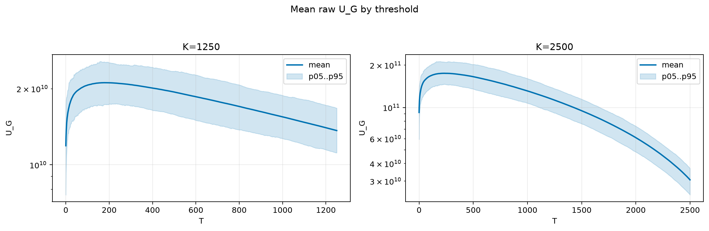
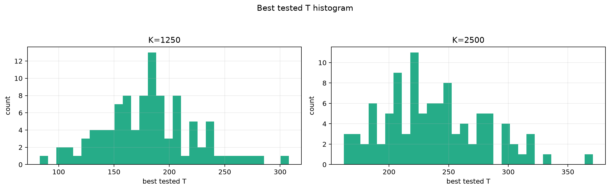
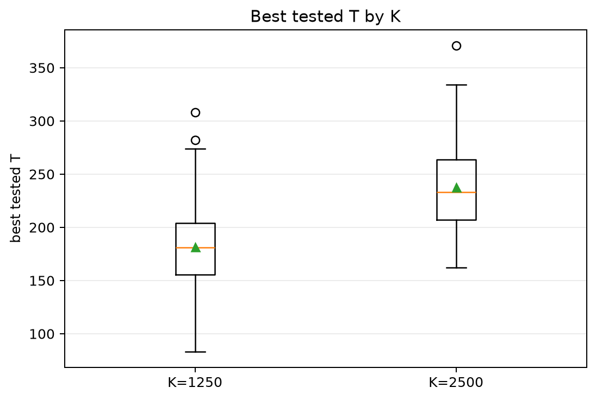
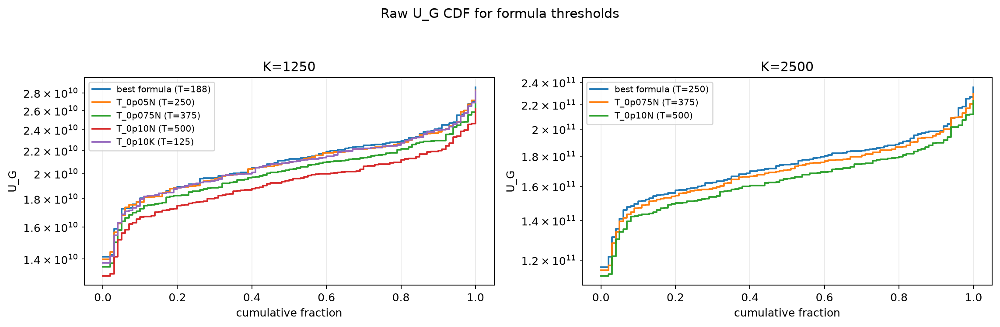
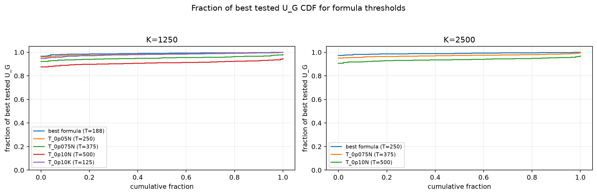

# Threshold Full Sweep: twdp

- N: 5000
- L: 2
- K values: 1250, 2500
- Samples: 100
- Generator seeds: 42
- Sigma: 1.0

The experiment sweeps every integer `T` from `0` to `K` and evaluates raw `U_G`.

## Answer

- `K=1250`: best fixed `T=178`; 99% mean-`U_G` diapason `125..264`; best tested `T` median `181.0` (p05..p95 `115.8..252.4`).
- `K=2500`: best fixed `T=233`; 99% mean-`U_G` diapason `163..332`; best tested `T` median `233.0` (p05..p95 `174.9..315.1`).

## Best Fixed Thresholds And Formula Checks

| K | best fixed T | 99% diapason | best tested T median | best tested T std | best formula | formula T | formula fraction |
|---:|---:|---|---:|---:|---|---:|---:|
| 1250 | 178 | 125..264 | 181.000 | 41.365 | T_0p075NL_over_Lp2 | 188 | 0.9904 |
| 2500 | 233 | 163..332 | 233.000 | 42.579 | T_0p05N | 250 | 0.9904 |

## Plots

## Artifacts

- `threshold_runs.csv.gz`
- `best_thresholds.csv`
- `threshold_summary.csv`
- `threshold_best_t_stats.csv`
- `threshold_formula_comparison.csv`
