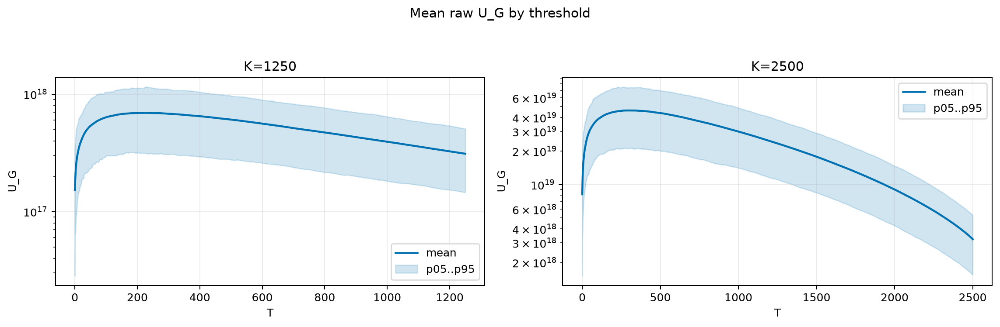
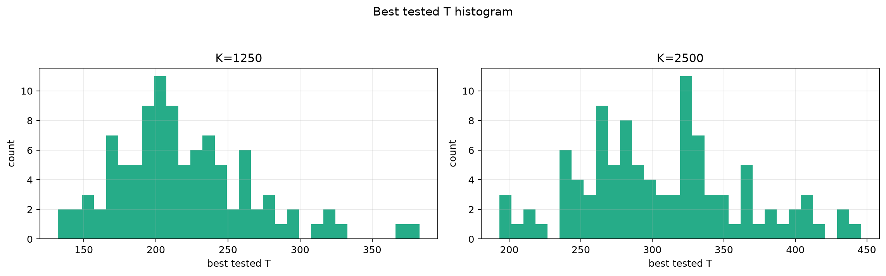
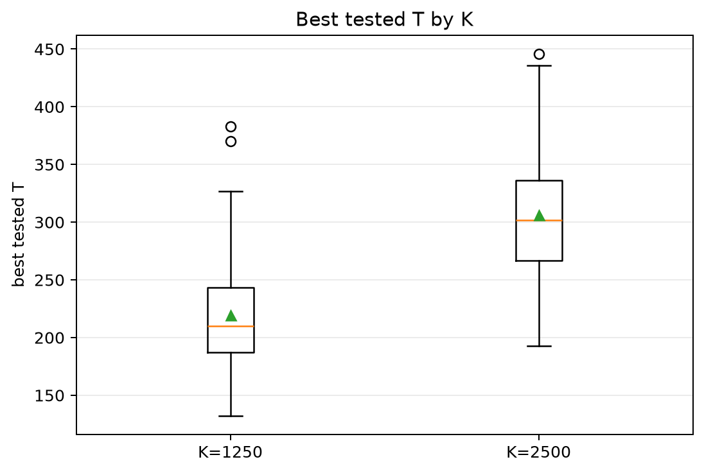
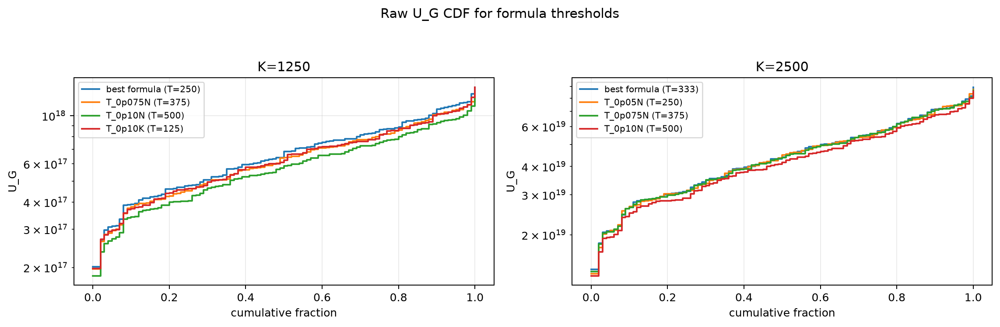
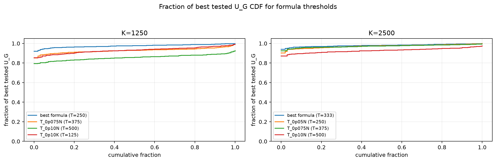

# Threshold Full Sweep: gaussian

- N: 5000
- L: 4
- K values: 1250, 2500
- Samples: 100
- Generator seeds: 42
- Sigma: 1.0

The experiment sweeps every integer `T` from `0` to `K` and evaluates raw `U_G`.

## Answer

- `K=1250`: best fixed `T=230`; 99% mean-`U_G` diapason `176..280`; best tested `T` median `210.0` (p05..p95 `151.8..309.7`).
- `K=2500`: best fixed `T=309`; 99% mean-`U_G` diapason `246..383`; best tested `T` median `301.5` (p05..p95 `217.0..410.1`).

## Best Fixed Thresholds And Formula Checks

| K | best fixed T | 99% diapason | best tested T median | best tested T std | best formula | formula T | formula fraction |
|---:|---:|---|---:|---:|---|---:|---:|
| 1250 | 230 | 176..280 | 210.000 | 47.809 | T_0p05N | 250 | 0.9748 |
| 2500 | 309 | 246..383 | 301.500 | 56.612 | T_0p10NL_over_Lp2 | 333 | 0.9799 |

## Plots

## Artifacts

- `threshold_runs.csv.gz`
- `best_thresholds.csv`
- `threshold_summary.csv`
- `threshold_best_t_stats.csv`
- `threshold_formula_comparison.csv`
