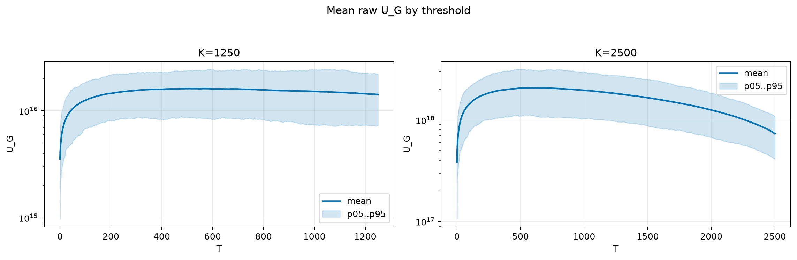
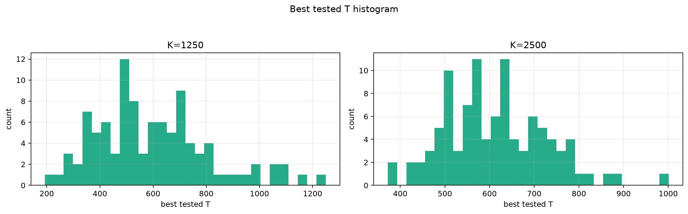
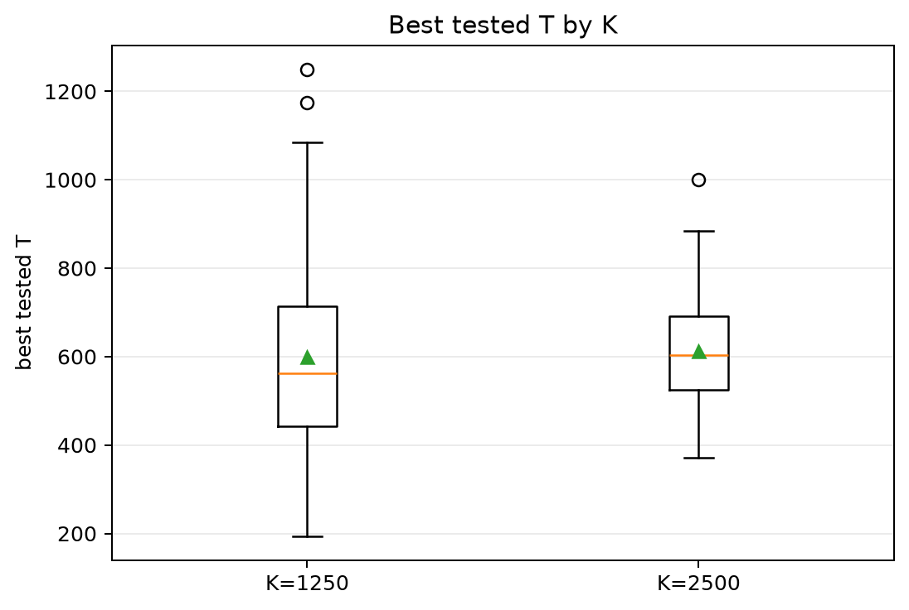
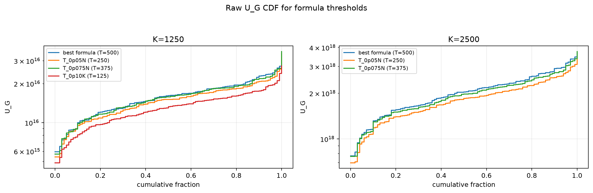
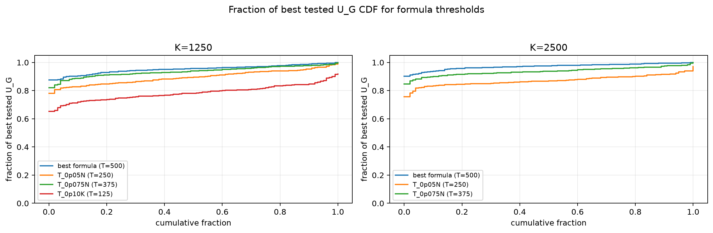

# Threshold Full Sweep: rician

> Historical K semantics note: this report uses active-K semantics. Here `K` is the number of selected/kept antennas, not the number turned off. A `25% active` or `K=0.25N` case means `75% off`, not the real `25% off` task. For real off-percent experiments, `25% off => K_active=0.75N` and `50% off => K_active=0.50N`.

- N: 5000
- L: 4
- K values: 1250, 2500
- Samples: 100
- Generator seeds: 42
- Sigma: 1.0

The experiment sweeps every integer `T` from `0` to `K` and evaluates raw `U_G`.

## Answer

- `K=1250`: best fixed `T=567`; 99% mean-`U_G` diapason `424..659`; best tested `T` median `562.5` (p05..p95 `307.4..1053.8`).
- `K=2500`: best fixed `T=575`; 99% mean-`U_G` diapason `485..752`; best tested `T` median `603.5` (p05..p95 `440.9..788.5`).

## Best Fixed Thresholds And Formula Checks

| K | best fixed T | 99% diapason | best tested T median | best tested T std | best formula | formula T | formula fraction |
|---:|---:|---|---:|---:|---|---:|---:|
| 1250 | 567 | 424..659 | 562.500 | 215.839 | T_0p10N | 500 | 0.9527 |
| 2500 | 575 | 485..752 | 603.500 | 113.874 | T_0p10N | 500 | 0.9718 |

## Plots

## Artifacts

- `threshold_runs.csv.gz`
- `best_thresholds.csv`
- `threshold_summary.csv`
- `threshold_best_t_stats.csv`
- `threshold_formula_comparison.csv`
