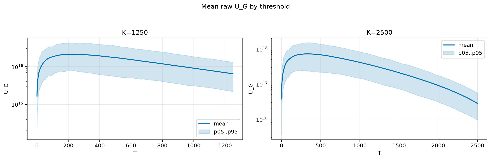
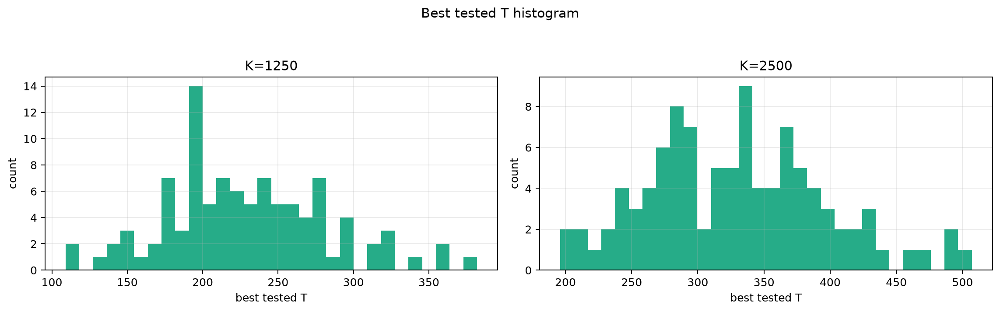
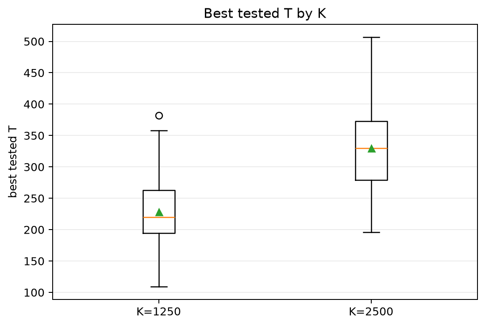
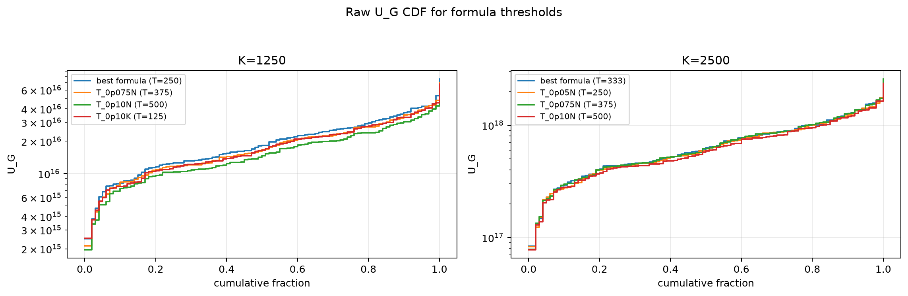
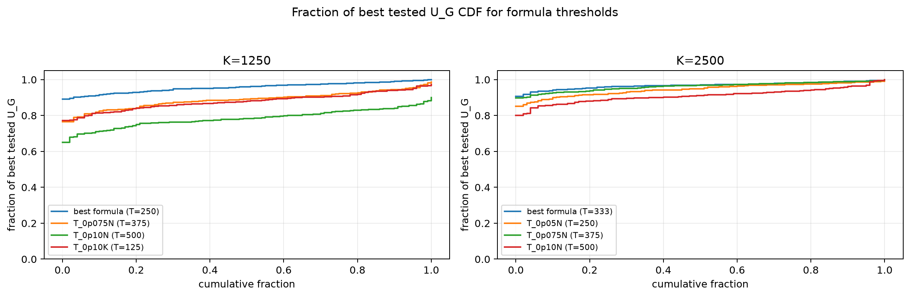

# Threshold Full Sweep: thin_tail

- N: 5000
- L: 4
- K values: 1250, 2500
- Samples: 100
- Generator seeds: 42
- Sigma: 1.0

The experiment sweeps every integer `T` from `0` to `K` and evaluates raw `U_G`.

## Answer

- `K=1250`: best fixed `T=206`; 99% mean-`U_G` diapason `180..259`; best tested `T` median `220.0` (p05..p95 `147.8..321.2`).
- `K=2500`: best fixed `T=318`; 99% mean-`U_G` diapason `284..391`; best tested `T` median `330.0` (p05..p95 `227.7..440.9`).

## Best Fixed Thresholds And Formula Checks

| K | best fixed T | 99% diapason | best tested T median | best tested T std | best formula | formula T | formula fraction |
|---:|---:|---|---:|---:|---|---:|---:|
| 1250 | 206 | 180..259 | 220.000 | 53.744 | T_0p05N | 250 | 0.9570 |
| 2500 | 318 | 284..391 | 330.000 | 67.456 | T_0p10NL_over_Lp2 | 333 | 0.9680 |

## Plots

## Artifacts

- `threshold_runs.csv.gz`
- `best_thresholds.csv`
- `threshold_summary.csv`
- `threshold_best_t_stats.csv`
- `threshold_formula_comparison.csv`
