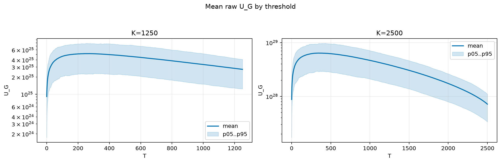
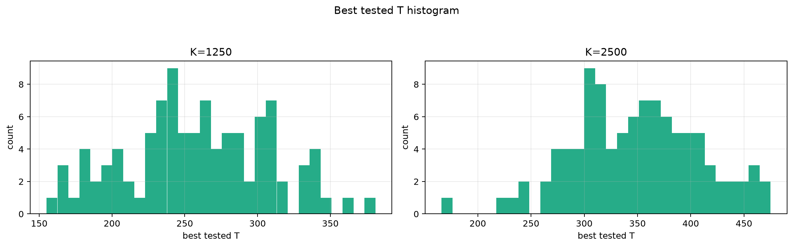
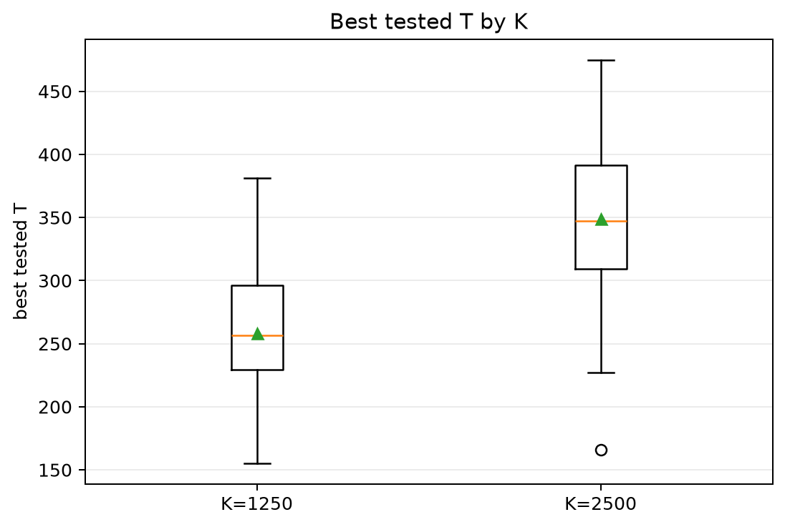
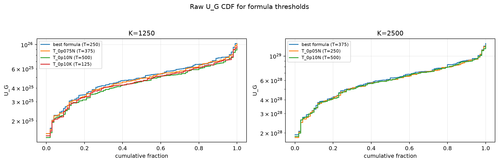
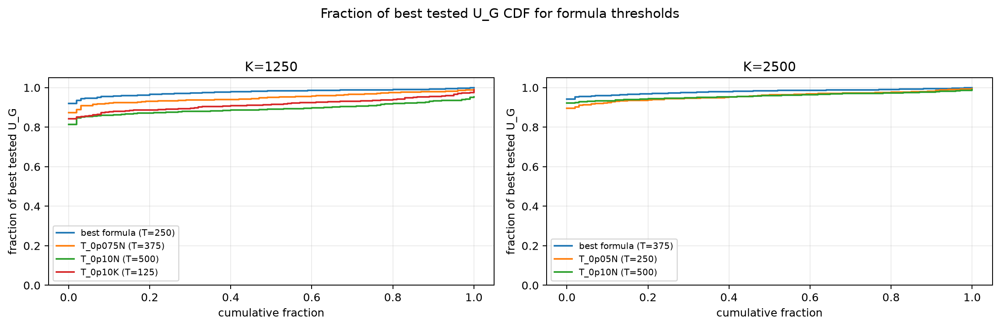

# Threshold Full Sweep: nakagami

- N: 5000
- L: 6
- K values: 1250, 2500
- Samples: 100
- Generator seeds: 42
- Sigma: 1.0

The experiment sweeps every integer `T` from `0` to `K` and evaluates raw `U_G`.

## Answer

- `K=1250`: best fixed `T=277`; 99% mean-`U_G` diapason `207..323`; best tested `T` median `256.5` (p05..p95 `178.8..339.1`).
- `K=2500`: best fixed `T=342`; 99% mean-`U_G` diapason `286..435`; best tested `T` median `347.5` (p05..p95 `263.1..450.6`).

## Best Fixed Thresholds And Formula Checks

| K | best fixed T | 99% diapason | best tested T median | best tested T std | best formula | formula T | formula fraction |
|---:|---:|---|---:|---:|---|---:|---:|
| 1250 | 277 | 207..323 | 256.500 | 49.651 | T_0p05N | 250 | 0.9780 |
| 2500 | 342 | 286..435 | 347.500 | 60.166 | T_0p075N | 375 | 0.9808 |

## Plots

## Artifacts

- `threshold_runs.csv.gz`
- `best_thresholds.csv`
- `threshold_summary.csv`
- `threshold_best_t_stats.csv`
- `threshold_formula_comparison.csv`
