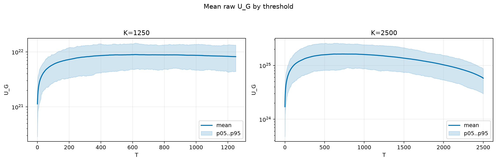
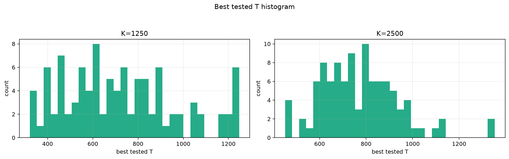
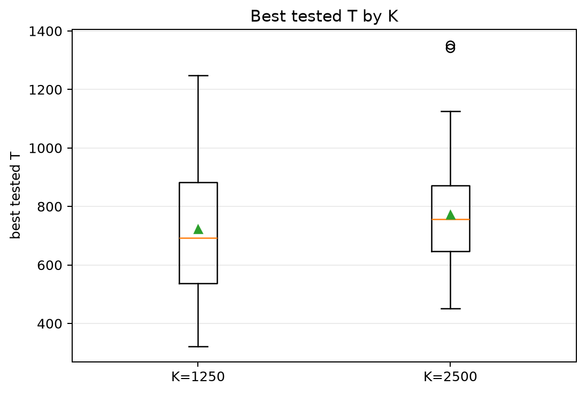
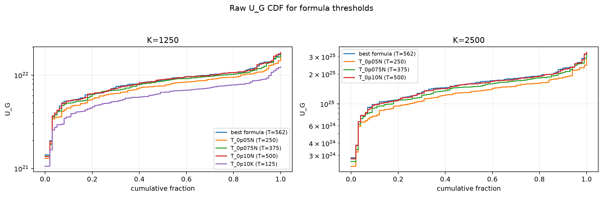
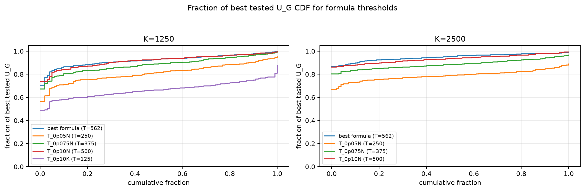

# Threshold Full Sweep: rician

- N: 5000
- L: 6
- K values: 1250, 2500
- Samples: 100
- Generator seeds: 42
- Sigma: 1.0

The experiment sweeps every integer `T` from `0` to `K` and evaluates raw `U_G`.

## Answer

- `K=1250`: best fixed `T=617`; 99% mean-`U_G` diapason `563..681`; best tested `T` median `692.5` (p05..p95 `384.1..1222.0`).
- `K=2500`: best fixed `T=738`; 99% mean-`U_G` diapason `583..929`; best tested `T` median `756.0` (p05..p95 `524.9..1045.1`).

## Best Fixed Thresholds And Formula Checks

| K | best fixed T | 99% diapason | best tested T median | best tested T std | best formula | formula T | formula fraction |
|---:|---:|---|---:|---:|---|---:|---:|
| 1250 | 617 | 563..681 | 692.500 | 251.005 | T_0p15NL_over_Lp2 | 562 | 0.9223 |
| 2500 | 738 | 583..929 | 756.000 | 167.304 | T_0p15NL_over_Lp2 | 562 | 0.9483 |

## Plots

## Artifacts

- `threshold_runs.csv.gz`
- `best_thresholds.csv`
- `threshold_summary.csv`
- `threshold_best_t_stats.csv`
- `threshold_formula_comparison.csv`
