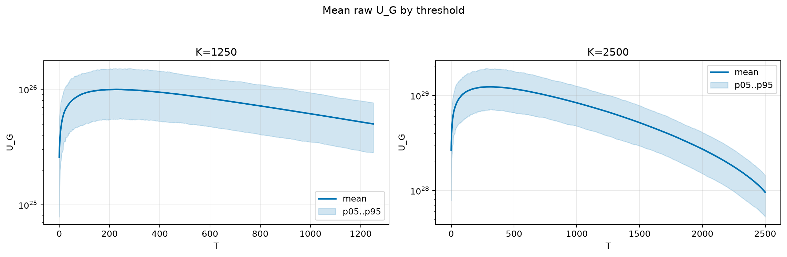
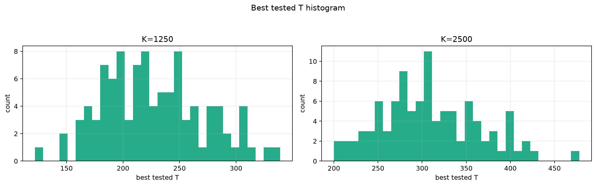
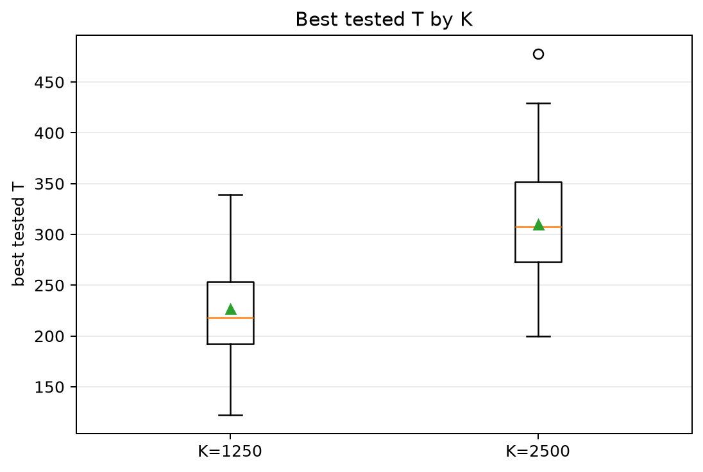
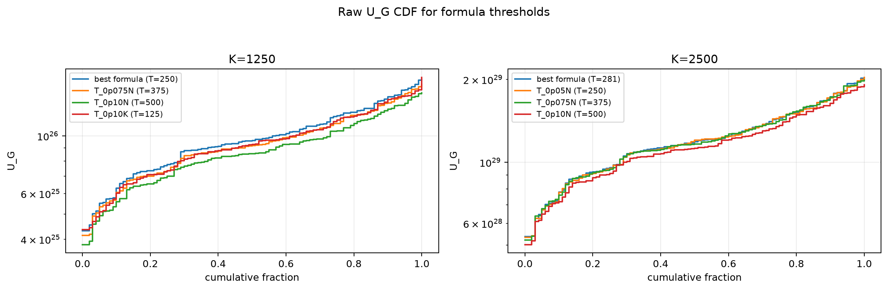
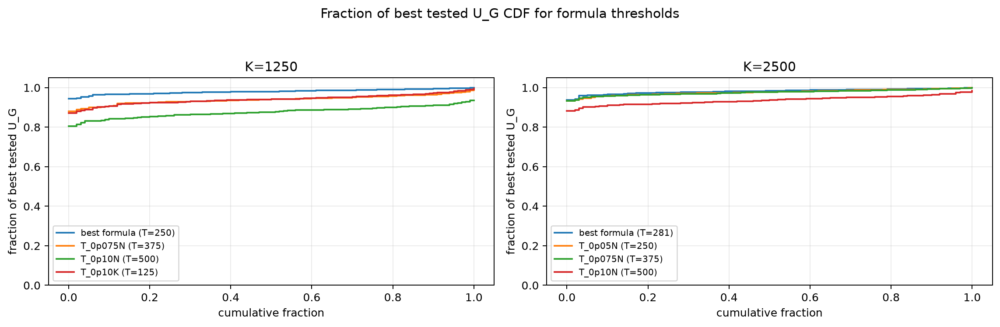

# Threshold Full Sweep: twdp

- N: 5000
- L: 6
- K values: 1250, 2500
- Samples: 100
- Generator seeds: 42
- Sigma: 1.0

The experiment sweeps every integer `T` from `0` to `K` and evaluates raw `U_G`.

## Answer

- `K=1250`: best fixed `T=229`; 99% mean-`U_G` diapason `177..284`; best tested `T` median `218.0` (p05..p95 `164.9..307.1`).
- `K=2500`: best fixed `T=311`; 99% mean-`U_G` diapason `241..380`; best tested `T` median `307.5` (p05..p95 `220.0..402.3`).

## Best Fixed Thresholds And Formula Checks

| K | best fixed T | 99% diapason | best tested T median | best tested T std | best formula | formula T | formula fraction |
|---:|---:|---|---:|---:|---|---:|---:|
| 1250 | 229 | 177..284 | 218.000 | 44.700 | T_0p05N | 250 | 0.9802 |
| 2500 | 311 | 241..380 | 307.500 | 56.336 | T_0p075NL_over_Lp2 | 281 | 0.9822 |

## Plots

## Artifacts

- `threshold_runs.csv.gz`
- `best_thresholds.csv`
- `threshold_summary.csv`
- `threshold_best_t_stats.csv`
- `threshold_formula_comparison.csv`
