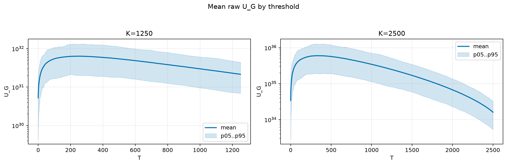
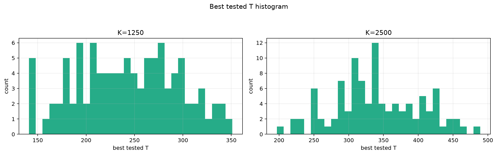
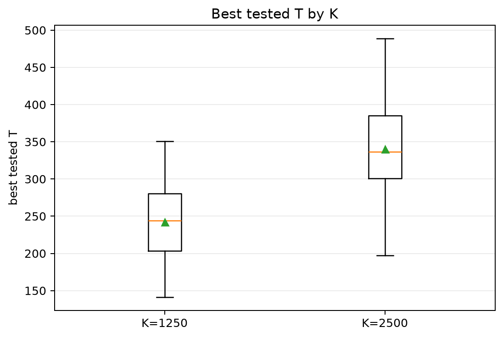
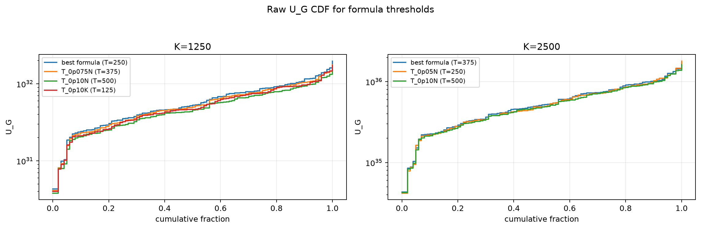
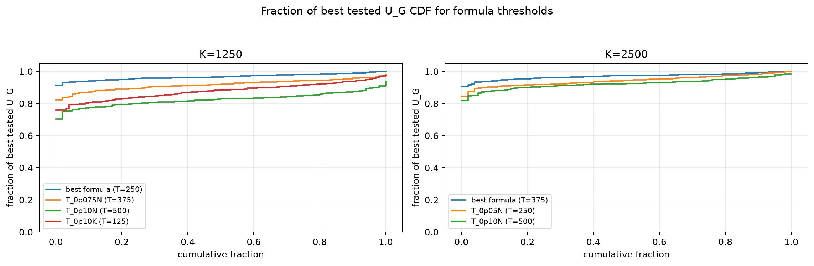

# Threshold Full Sweep: rayleigh

- N: 5000
- L: 8
- K values: 1250, 2500
- Samples: 100
- Generator seeds: 42
- Sigma: 1.0

The experiment sweeps every integer `T` from `0` to `K` and evaluates raw `U_G`.

## Answer

- `K=1250`: best fixed `T=251`; 99% mean-`U_G` diapason `210..287`; best tested `T` median `244.0` (p05..p95 `158.4..326.4`).
- `K=2500`: best fixed `T=343`; 99% mean-`U_G` diapason `287..400`; best tested `T` median `336.5` (p05..p95 `246.4..443.2`).

## Best Fixed Thresholds And Formula Checks

| K | best fixed T | 99% diapason | best tested T median | best tested T std | best formula | formula T | formula fraction |
|---:|---:|---|---:|---:|---|---:|---:|
| 1250 | 251 | 210..287 | 244.000 | 52.202 | T_0p05N | 250 | 0.9662 |
| 2500 | 343 | 287..400 | 336.500 | 61.800 | T_0p075N | 375 | 0.9692 |

## Plots

## Artifacts

- `threshold_runs.csv.gz`
- `best_thresholds.csv`
- `threshold_summary.csv`
- `threshold_best_t_stats.csv`
- `threshold_formula_comparison.csv`
