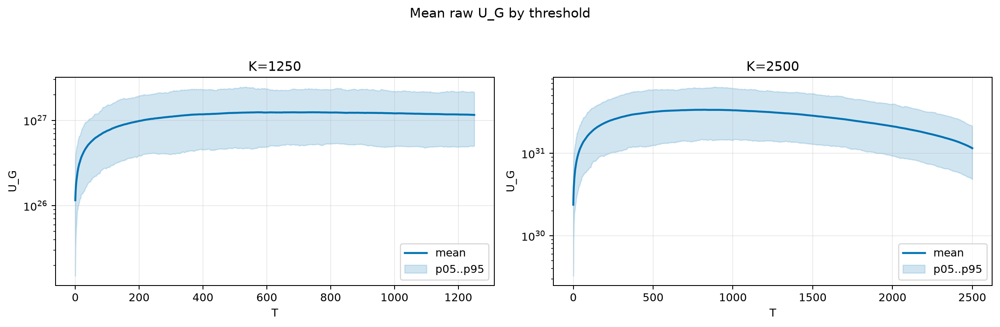
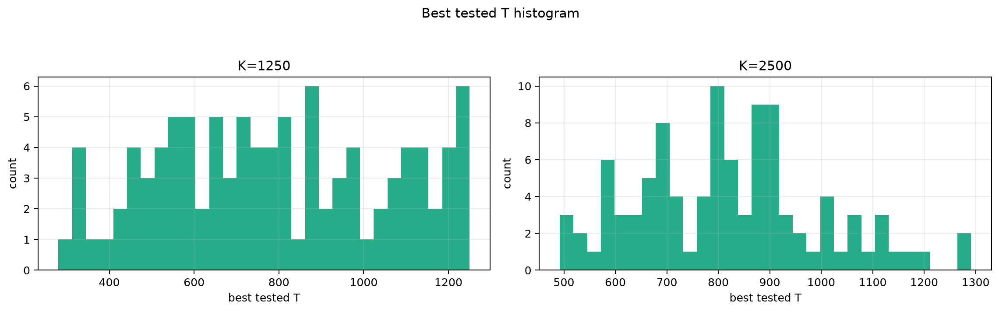
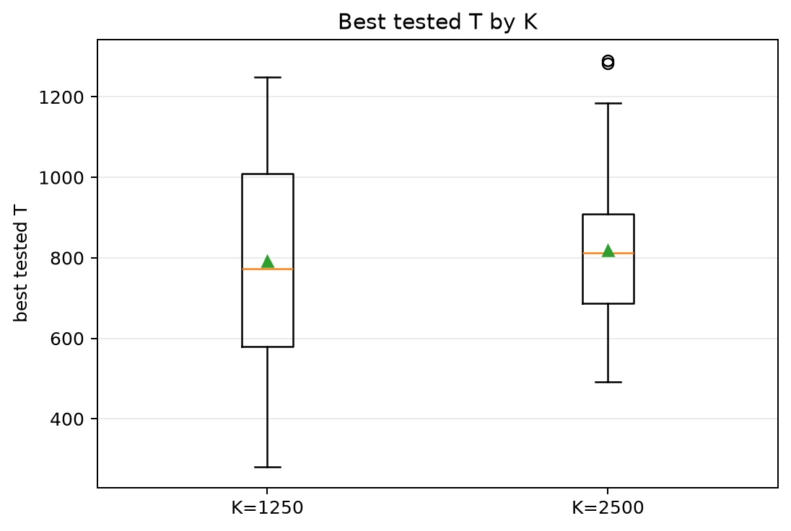
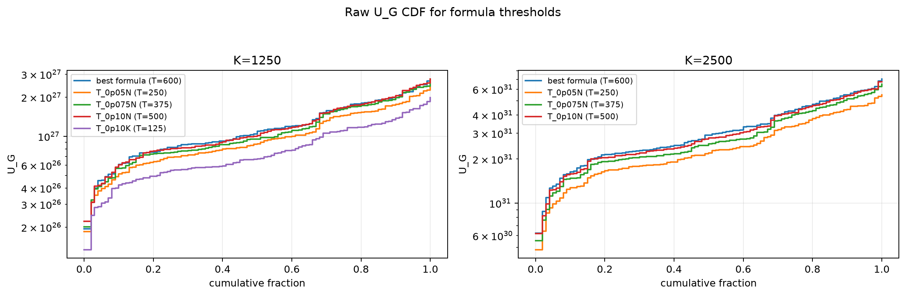
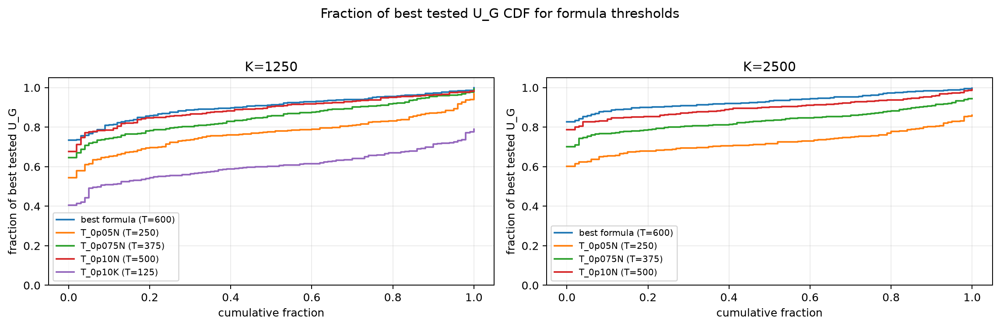

# Threshold Full Sweep: rician

- N: 5000
- L: 8
- K values: 1250, 2500
- Samples: 100
- Generator seeds: 42
- Sigma: 1.0

The experiment sweeps every integer `T` from `0` to `K` and evaluates raw `U_G`.

## Answer

- `K=1250`: best fixed `T=745`; 99% mean-`U_G` diapason `524..829`; best tested `T` median `773.0` (p05..p95 `344.8..1219.5`).
- `K=2500`: best fixed `T=816`; 99% mean-`U_G` diapason `710..969`; best tested `T` median `812.0` (p05..p95 `551.5..1124.3`).

## Best Fixed Thresholds And Formula Checks

| K | best fixed T | 99% diapason | best tested T median | best tested T std | best formula | formula T | formula fraction |
|---:|---:|---|---:|---:|---|---:|---:|
| 1250 | 745 | 524..829 | 773.000 | 268.844 | T_0p15NL_over_Lp2 | 600 | 0.9044 |
| 2500 | 816 | 710..969 | 812.000 | 178.358 | T_0p15NL_over_Lp2 | 600 | 0.9322 |

## Plots

## Artifacts

- `threshold_runs.csv.gz`
- `best_thresholds.csv`
- `threshold_summary.csv`
- `threshold_best_t_stats.csv`
- `threshold_formula_comparison.csv`
