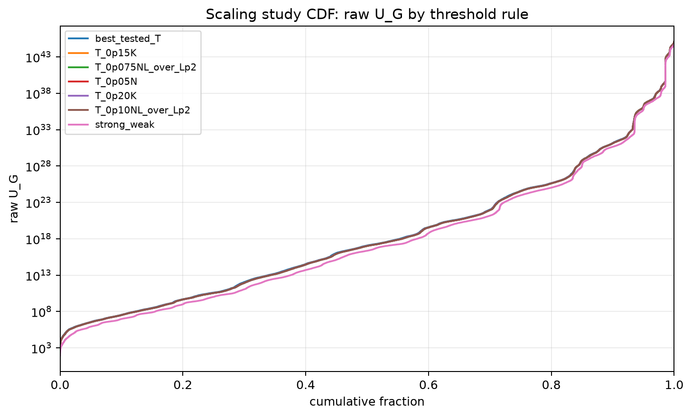
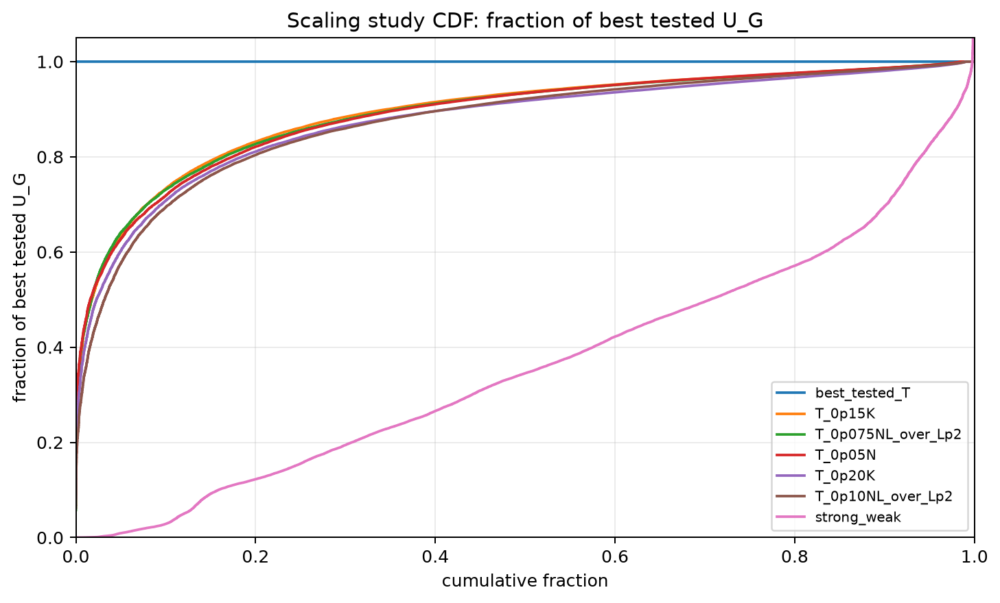
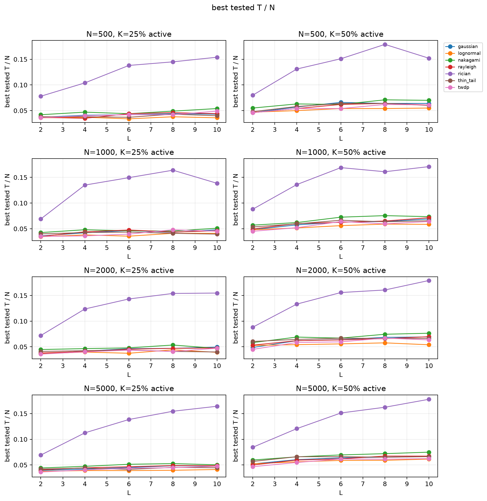
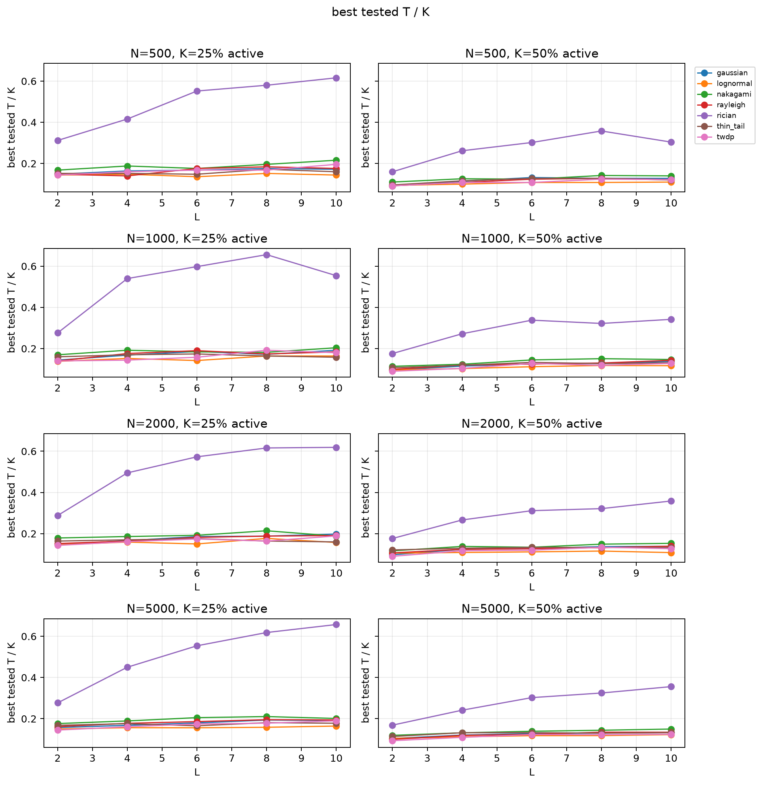
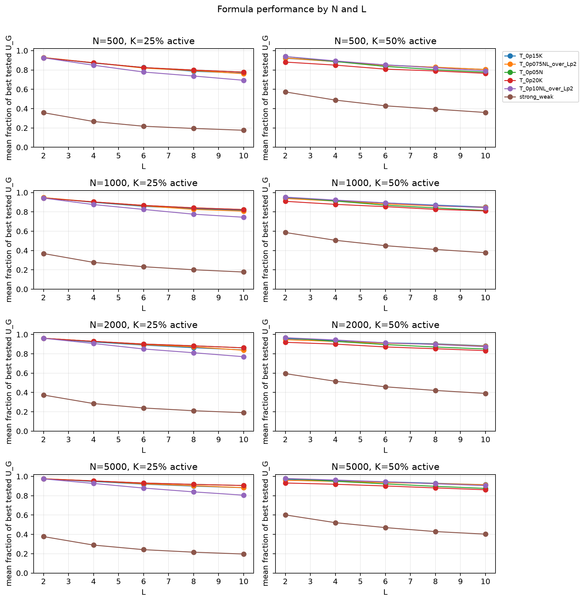
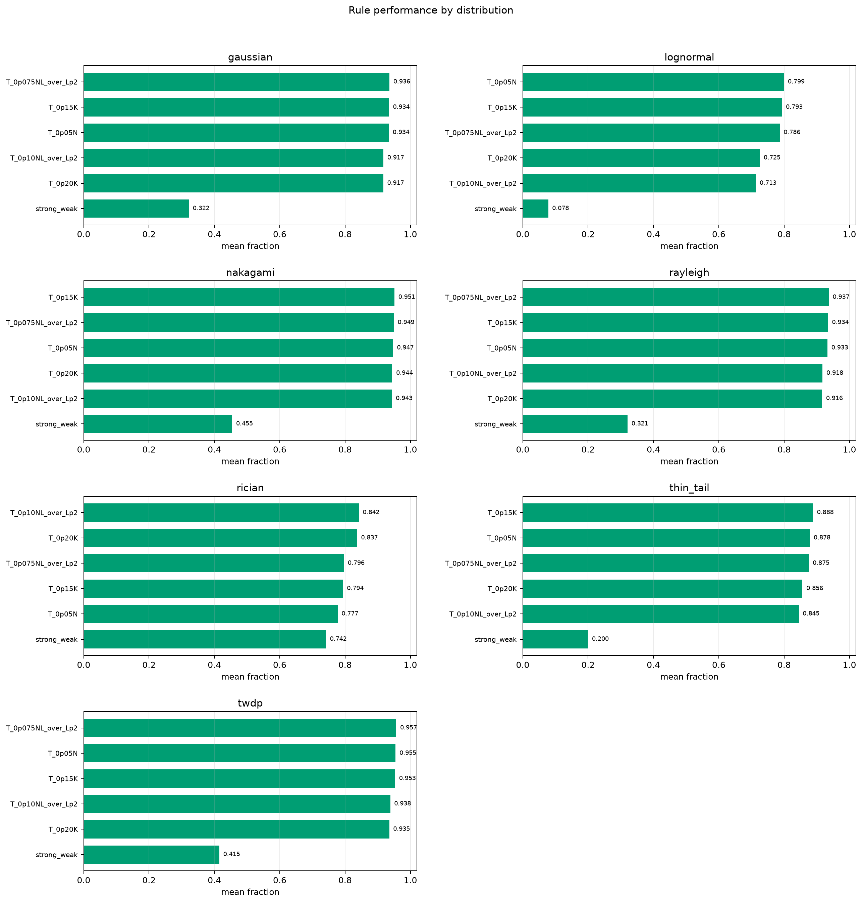

# Preliminary Threshold Scaling Study

- N values: 500, 1000, 2000, 5000
- L values: 2, 4, 6, 8, 10
- Active K percentages: 25.0, 50.0
- Samples: 100
- Generator seeds: 42
- Profiles: gaussian, lognormal, nakagami, rayleigh, rician, thin_tail, twdp
- Sigma: 1.0

## Direct Answer

- Best global tested rule: `T_0p15K` with mean fraction of best tested `U_G` `0.8927` and mean gap `10.73%`.
- The same rule is within 99% of the best rule for `57.1%` of `(N, L, distribution, K%)` contexts.
- The strongest rule family is `N_L` with mean fraction `0.8483`.
- Mean best tested threshold scale over all contexts: `T/N=0.0653`.
- Strong/weak H3: mean fraction `0.3617`, mean p05 fraction `0.3008`, mean gap `63.83%`; outside dense `T=0..K` in `50.0%` of contexts.
- Distribution shift by `T/N`: left/lower `lognormal, twdp, thin_tail, gaussian, rayleigh`; right/higher `rician`.
- Best single distribution metric predictor is `tail_mass_p80` with moderate Pearson correlation `-0.283` to `T/N`.

## Rule Ranking

| rule | family | contexts | mean fraction | p05 fraction avg | mean gap % |
|---|---|---:|---:|---:|---:|
| T_0p15K | K | 280 | 0.8927 | 0.7895 | 10.73 |
| T_0p075NL_over_Lp2 | N_L | 280 | 0.8909 | 0.7876 | 10.91 |
| T_0p05N | N | 280 | 0.8890 | 0.7831 | 11.10 |
| T_0p20K | K | 280 | 0.8759 | 0.7723 | 12.41 |
| T_0p10NL_over_Lp2 | N_L | 280 | 0.8738 | 0.7704 | 12.62 |
| T_0p075N | N | 280 | 0.8722 | 0.7675 | 12.78 |
| T_0p05NL_over_Lp2 | N_L | 280 | 0.8564 | 0.7333 | 14.36 |
| T_0p10K | K | 280 | 0.8554 | 0.7313 | 14.46 |
| T_0p125NL_over_Lp2 | N_L | 280 | 0.8348 | 0.7289 | 16.52 |
| T_0p10N | N | 280 | 0.8139 | 0.7060 | 18.61 |
| T_0p15NL_over_Lp2 | N_L | 280 | 0.7858 | 0.6831 | 21.42 |
| T_0p025N | N | 280 | 0.7802 | 0.6419 | 21.98 |

## Best Tested Threshold Scale By Distribution

| profile | mean T/N | mean T/K |
|---|---:|---:|
| lognormal | 0.0476 | 0.1345 |
| twdp | 0.0509 | 0.1449 |
| thin_tail | 0.0532 | 0.1493 |
| gaussian | 0.0537 | 0.1521 |
| rayleigh | 0.0537 | 0.1526 |
| nakagami | 0.0588 | 0.1667 |
| rician | 0.1392 | 0.4103 |

## Strong/Weak H3 By Distribution

| profile | mean fraction | p05 fraction avg | mean gap % | outside dense rate |
|---|---:|---:|---:|---:|
| rician | 0.7416 | 0.5738 | 25.84 | 50.0% |
| nakagami | 0.4545 | 0.4019 | 54.55 | 50.0% |
| twdp | 0.4152 | 0.3676 | 58.48 | 50.0% |
| gaussian | 0.3219 | 0.2727 | 67.81 | 50.0% |
| rayleigh | 0.3209 | 0.2734 | 67.91 | 50.0% |
| thin_tail | 0.1999 | 0.1583 | 80.01 | 50.0% |
| lognormal | 0.0780 | 0.0578 | 92.20 | 50.0% |

## Plots

## Artifacts

- `all_best_thresholds.csv`
- `all_threshold_best_t_stats.csv`
- `all_distribution_comparison.csv`
- `all_formula_comparison.csv`
- `all_scaling_formula_summary.csv`
- `all_scaling_metric_correlations.csv`
- `all_formula_selected_runs.csv`
- `all_strong_weak_runs.csv`
- `all_strong_weak_summary.csv`
- Per-shard `threshold_runs.csv.gz` and report files under `N{N}/L{L}/{profile}/`.
